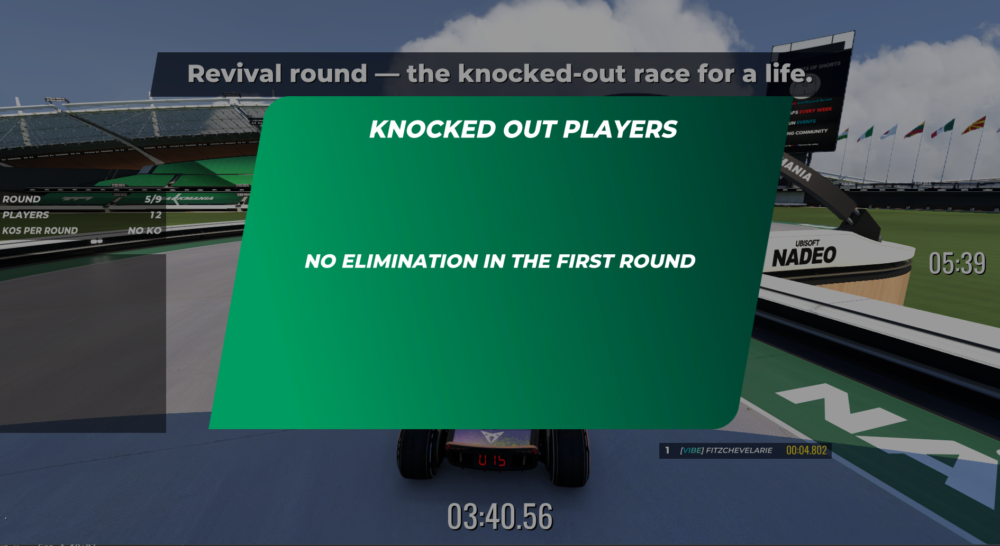

# Nadeo's Knockout UI modules, read from a live client

Captured 2026-09-05 from a running TM2020 client with `GET /layers/{index}` on the bridge.
These four modules ship inside the title pack with no published source, so the ManiaLink
they produce is the only readable form. Raw captures are in
[`examples/hud-layers/`](../../examples/hud-layers/).

Layer indexes shift as layers come and go. Identify a module by the `name` attribute on its
`<manialink>` tag, never by index.

## The question this answers

Can `UIModules_KnockedOutPlayers` be reused for the KOTD gulag screens by passing it a
different list of account IDs, or does it hard-code an elimination header?

**It hard-codes the header.** Screens that show gulag entrants or revived players need their
own layer.

## UIModule_Knockout_KnockedOutPlayers

The roll-call popup. `UIModules_KnockedOutPlayers::DisplayEliminatedPlayer(accountIds, ranks)`
does take an arbitrary list, but everything around that list is fixed text.

The title is a literal with no `id`, so no script can reach it, Nadeo's or ours:

```xml
<label z-index="1" pos="7.38385 41.9537" size="100 12" class="label-base" textsize="7"
       text="Knocked out players" />
```

The subtitle has an `id`, but the page script fills it from a hardcoded string:

```
Label_EliminatedPlayersNb.Value = TL::Compose("%1 players eliminated", ""^_ScheduledAnimation.EliminatedPlayersNb);
```

The whole netread interface is five variables, and none carries a title:

```
declare netread Boolean   Net_Knockout_KnockedOutPlayers_DisplayContent for Teams[0] = False;
declare netread Text[]    Net_Knockout_KnockedOutPlayers_AccountIds for Teams[0];
declare netread Integer[] Net_Knockout_KnockedOutPlayers_Ranks for Teams[0];
declare netread Integer   Net_Knockout_KnockedOutPlayers_EliminatedPlayerUpdate for Teams[0];
declare netread Boolean   Net_Knockout_KnockedOutPlayers_IsVisible for Owner;
```

Feed it revived players and the screen reads "Knocked out players / 4 players eliminated"
over four people who just survived.

Two more things the capture settles, both visible on screen during the staging mode:

- The popup dims the whole screen with `<quad id="quad-black-bg" size="400 200" bgcolor="000"
  opacity="0.4" fullscreen="1"/>`, so it covers a `BigMessage` shown at the same time.
- A first-round special case is its own frame, `frame-no-elimination`, with the literal
  "No elimination in first round".

## What it actually renders



Staged with `KackyKOTTGulagShot.Script.txt` on 2026-09-05: round 5 of 9, twelve alive, zero
KOs, `DisplayContent(True)` and no account IDs.

Three things this shows that the XML alone does not:

- An empty account ID list does not render an empty popup. The module falls back to
  `frame-no-elimination` and says "NO ELIMINATION IN THE FIRST ROUND", in round 5. So the stock
  module cannot serve as a blank frame to write our own content into either.
- `textprefix="$i$t"` on `label-base` uppercases and italicises every label in the module,
  header and player rows alike. Match that in a custom layer or it will not look like the same
  game.
- `UIModules_KnockoutInfo::SetKOsNumber(0, 0)` renders "NO KO" in the corner widget. That reads
  correctly for a revival round, where nobody is knocked out, so the widget needs no
  replacement even though the popup does.

Use the capture as the template for our own layer. It carries the styling that makes a screen
look native: `GameFontExtraBold` with `textprefix="$i$t"`, title at `textsize="7"`, name and
rank rows at `textsize="4"`, the popup background
`Media/Manialinks/Nadeo/Trackmania/Modes/Knockout/TM_UI_HUD_02_KnockOut_Popup.dds`, the KO
stamp `TM_UI_HUD_02_KnockOut_KOSign.dds`, and the paging geometry in `frame-slots-1`,
`frame-slots-2` and so on.

## UIModule_Knockout_KnockoutInfo

The persistent corner widget. Round counter, alive count and KOs per round, all driven from
the mode through `UIModules_KnockoutInfo`:

```
Net_Knockout_KnockoutInfo_MapRoundNb / _MapRoundTotal / _RoundNb / _RoundTotal
Net_Knockout_KnockoutInfo_PlayersNb / _KOsNumber / _KOsMilestone
Net_Knockout_KnockoutInfo_RankingUpdate / _ServerNumber
Net_Knockout_PlayerIsAlive for Score, Net_Knockout_DNF for Score
```

Its literals are "Track rounds", "Round", "Players" and "KOs per round". This module is
customisable through `Net_LibUI3_CustomizableModule_Properties`, which the roll-call module
does not have. That covers position, size and visibility of the widget's parts, not its text.

## UIModule_Knockout_KnockoutReward

The end-of-run screen for one player: rank, cup rank, trophies, and the "Quit" or "Stay"
choice after "You have been eliminated". Per-player, addressed `for UI` and `for InputPlayer`
rather than `for Teams[0]`.

## UIModule_Knockout_EliminationWarning

Warns a player they are about to be eliminated. Carries Royal ranking netreads alongside the
knockout ones, so it is shared with Royal.

## A big message with no duration never hides

Not a knockout module, but it lands in the same round-end sequence and looked like a bug in
our code. `UIModules_BigMessage::SetMessage(_("..."))` stays on screen forever.

Every overload without an explicit duration passes 0:

```
Void SetMessage(Text _Message) { SetMessage(_Message, 0); }
```

which the server turns into no end time at all:

```
Net_BigMessage_EndTime = Now + _Duration;
...
if (_Duration <= 0) Net_BigMessage_EndTime = 0;
```

and the client only ever hides on a positive one:

```
if (IsMessageVisible && Net_BigMessage_EndTime > 0 && Net_BigMessage_EndTime < GameTime) {
	IsMessageVisible = SetMessageVisibility(Controls, False);
}
```

So a message with no duration waits to be overwritten by the next one. Pass milliseconds for
anything that should end, and set it to the same lifetime as any screen it accompanies. Source:
`refs/maniascript-sharp/src/ManiaScriptSharp.Trackmania/Scripts/Libs/Nadeo/TMGame/Modes/Base/UIModules/BigMessage_{Server,Client}.Script.txt`.

## Reproducing a capture

Openplanet's Developer Mode turns on School Mode, which disconnects the client from any server
running a map outside the Openplanet School Campaign, a local dedicated server included. See
https://openplanet.dev/docs/school-mode and https://openplanet.dev/user/trusted.

To capture again without trusted developer status, serve a School Campaign map. This capture
came from the KackyGG harness running `KackyKOTTGulagShot.Script.txt` on School #01
(`vqxvpntW8rkSOgOfJwsTaH3_Jrj`), which fakes a revival round and re-pushes the HUD state every
two seconds, so the roll-call stays up instead of flashing for four seconds. Campaign map files
download from `https://core.trackmania.nadeo.live/maps/{id}/file`, listed by
`https://trackmania.io/api/campaign/9/35357`.
